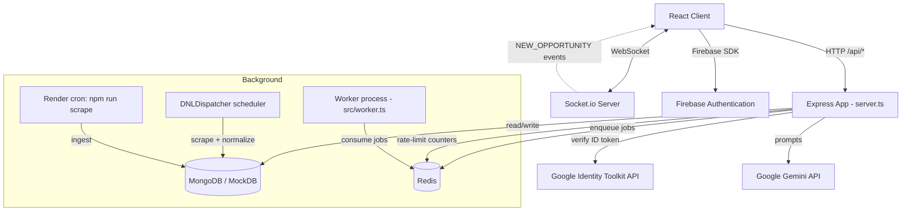
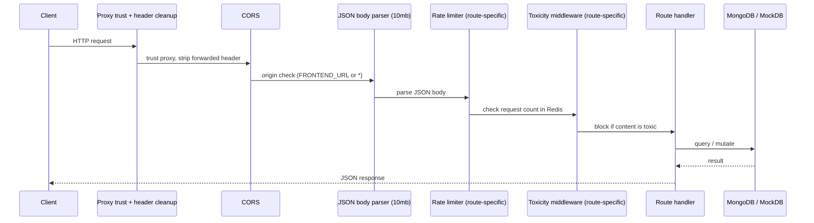
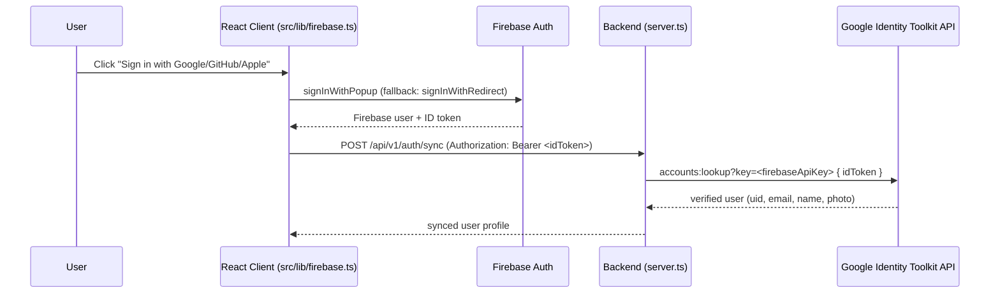
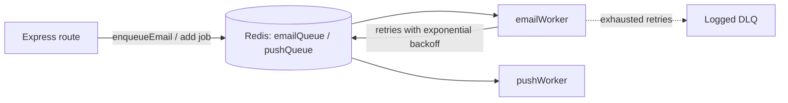
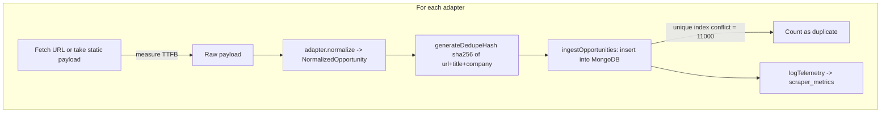

# Backend Architecture

This document explains how the YuvaHub backend is structured and how its
components — the Express server, middleware, real-time layer, background
queues, the scraper pipeline, the database layer, and the AI integration —
interact. It is intended to let a new contributor understand the backend
without reading every source file first.

## Table of Contents
- [Project Structure](#project-structure)
- [High-Level Overview](#high-level-overview)
- [Request Lifecycle](#request-lifecycle)
- [Authentication Flow](#authentication-flow)
- [Real-Time (Socket.io) Layer](#real-time-socketio-layer)
- [Queue Architecture](#queue-architecture)
- [Scraper Pipeline (DNL)](#scraper-pipeline-dnl)
- [Database Layer](#database-layer)
- [AI Integration](#ai-integration)
- [Rate Limiting & Content Safety](#rate-limiting--content-safety)
- [Analytics Buffer & Graceful Shutdown](#analytics-buffer--graceful-shutdown)
- [API Reference](#api-reference)
- [Contributor Guidance](#contributor-guidance)

---

## Project Structure

The backend is a single Express application defined in `server.ts` at the repo
root, with supporting modules under `src/`. Unlike a typical multi-folder
Express app, most HTTP route handlers live inside the `startServer()` function
in `server.ts`; shared logic (scrapers, queues, models, AI helpers) is factored
into modules.

```
YuvaHub/
├── server.ts                     # Main Express app: routes, middleware, Socket.io, bootstrapping
├── src/
│   ├── worker.ts                 # Standalone BullMQ worker entrypoint (npm run start:worker)
│   ├── queues/
│   │   ├── connection.ts         # Shared ioredis connection for BullMQ
│   │   ├── emailQueue.ts         # emailQueue + enqueueEmail() helper
│   │   └── pushQueue.ts          # pushQueue for push notifications
│   ├── workers/
│   │   ├── emailWorker.ts        # Consumes emailQueue jobs
│   │   └── pushWorker.ts         # Consumes pushQueue jobs
│   ├── services/
│   │   ├── toxicity.ts           # Toxicity check + Express middleware
│   │   ├── gemini.ts             # Frontend-facing Gemini helpers
│   │   └── dnl/                  # "Discovery & Normalization Layer" — scraper pipeline
│   │       ├── types.ts          # NormalizedOpportunity, IOpportunityAdapter, ScraperMetrics
│   │       ├── scheduler.ts      # DNLDispatcher: orchestrates scrape runs + telemetry
│   │       ├── deduplicator.ts   # Dedupe hashing + ingestOpportunities()
│   │       ├── metrics.ts        # DB index setup + telemetry logging
│   │       └── adapters/         # Per-source normalizers (Internshala, Devpost, ...)
│   ├── models/
│   │   └── scholarshipSchema.ts  # Zod schemas for scholarships + AI eligibility responses
│   └── lib/
│       └── firebase.ts           # Firebase client SDK setup (used by frontend)
├── scrape-cli.ts                 # Manual scraper run / DB verification (npm run scrape)
├── render.yaml                   # Render service definitions (web + cron scraper)
└── docs/                         # This documentation
```

Relevant npm scripts (`package.json`):

| Script | Command | Purpose |
| :--- | :--- | :--- |
| `dev` | `tsx server.ts` | Run the backend + Vite middleware in development |
| `build` | `vite build && esbuild server.ts ... dist/server.cjs` | Bundle frontend and backend |
| `start` | `node dist/server.cjs` | Run the production bundle |
| `start:worker` | `tsx src/worker.ts` | Run the background queue workers |
| `scrape` | `tsx scrape-cli.ts` | Run the scraper / ingestion verification |
| `test-mongo` | `tsx test-mongo.ts` | Check MongoDB connectivity |

---

## High-Level Overview



Key points:

- The Express app and the Socket.io server share the same Node HTTP server
  (`http.createServer(app)`), listening on port **5173**.
- In development, Vite runs in middleware mode so a single process serves both
  the API and the client. In production, the built client is served from
  `dist/` as static files with an SPA fallback.
- Redis backs both rate limiting and the BullMQ job queues, but the app is
  designed to **fail open** if Redis is unavailable.
- MongoDB is the primary datastore, with an in-memory `MockDB` fallback so the
  backend runs offline without a database.

---

## Request Lifecycle

A typical `POST /api/...` request flows through these stages, defined in order
inside `startServer()`:



Global middleware (applied to all routes):

1. `app.set('trust proxy', true)` — trust reverse proxies (Render, Cloudflare, nginx).
2. A small middleware that deletes the `forwarded` header to avoid
   `express-rate-limit` warnings behind a proxy.
3. `cors(corsOptions)` — origin is `FRONTEND_URL` when set, otherwise `*`.
4. `express.json({ limit: '10mb' })` — JSON body parsing (large limit supports
   resume/base64 payloads).

Per-route middleware:

- **Rate limiters** (`chatRateLimiter`, `resumeRateLimiter`) on AI endpoints.
- **Toxicity middleware** (`toxicityMiddleware`) on community comment endpoints.

Static / SPA handling runs last: Vite middleware in development, or
`express.static(dist)` plus a `GET *` fallback to `index.html` in production.

---

## Authentication Flow

Authentication is handled by **Firebase Authentication on the client**, and the
backend verifies the resulting ID token statelessly. There is no session store.



Details:

- Client auth providers are configured in `src/lib/firebase.ts`
  (`signInWithGoogle`, `signInWithGithub`, `signInWithApple`). Popup is tried
  first; on `auth/unauthorized-domain` or `auth/popup-blocked` it falls back to
  redirect.
- The backend reads the Firebase Web API key from `firebase-applet-config.json`
  and verifies ID tokens by calling Google's Identity Toolkit
  `accounts:lookup` endpoint. It does **not** use the Firebase Admin SDK.
- **Offline/dev mode:** if no Firebase API key is present, the backend decodes
  the JWT payload without cryptographic verification so local development works
  without live Firebase credentials. This path is for development only and must
  not be relied on for security in production.
- Endpoints expect the token in the `Authorization: Bearer <idToken>` header and
  return `401` when it is missing or invalid.

---

## Real-Time (Socket.io) Layer

A `socket.io` `Server` is attached to the same HTTP server and shares the CORS
configuration.

- On `connection`, the server logs the socket id and emits a
  `connected` event with `{ status: "ready" }`.
- The backend currently emits simulated `NEW_OPPORTUNITY` events on an interval
  (demo live-feed). Clients subscribe to these to show live opportunity alerts.
- `disconnect` is logged for observability.

This layer is intentionally lightweight; it is the extension point for
server-pushed notifications and live feed updates.

---

## Queue Architecture

Background work (email, push notifications) is offloaded to **BullMQ** queues
backed by Redis, so slow or failure-prone operations do not block HTTP requests.



- `src/queues/connection.ts` creates a shared `ioredis` connection
  (`REDIS_URL`, default `redis://localhost:6379`) with a retry strategy and
  `maxRetriesPerRequest: null` (required by BullMQ).
- `src/queues/emailQueue.ts` defines the `emailQueue` and an `enqueueEmail()`
  helper. Jobs are added with `attempts: 3` and exponential backoff.
- `src/workers/emailWorker.ts` and `pushWorker.ts` consume their respective
  queues. On failure they retry; once attempts are exhausted the job is logged
  as reaching a dead-letter queue (DLQ). The email worker includes a simulated
  failure path for resiliency testing.
- **Workers run in a separate process** (`src/worker.ts`, `npm run start:worker`),
  not inside the web server. `worker.ts` also handles `SIGINT`/`SIGTERM` for a
  graceful shutdown that closes each worker.

---

## Scraper Pipeline (DNL)

The **Discovery & Normalization Layer (DNL)** lives in `src/services/dnl/` and
turns heterogeneous source payloads into deduplicated, normalized opportunity
documents.



Components:

- **`types.ts`** — the contracts:
  - `NormalizedOpportunity` — the canonical shape every source is mapped to.
  - `IOpportunityAdapter` — `{ sourceName, normalize(rawPayload) }`.
  - `ScraperMetrics` — per-run telemetry (status, TTFB, counts, errors, yield).
- **Adapters** (`adapters/InternshalaAdapter.ts`, `DevpostAdapter.ts`) —
  implement `IOpportunityAdapter.normalize()` to map source-specific JSON into
  `NormalizedOpportunity[]`, filling sensible defaults for missing fields.
- **`deduplicator.ts`** — `generateDedupeHash(url, title, company)` produces a
  SHA-256 hash; `ingestOpportunities(db, items)` builds the DB document, inserts
  it, and classifies duplicate-key errors (`code 11000`) vs. real failures,
  returning `{ processed, inserted, duplicates, failures, errors }`.
- **`scheduler.ts`** — `DNLDispatcher` orchestrates a run for an adapter:
  fetch (measuring TTFB) → normalize → ingest → `logTelemetry`. It exposes
  `registerAdapter()`, `start(intervalMs)`, and `stop()`. The dispatcher is
  wired up in `server.ts` via `setupDNL(db)` and runs hourly.
- **`metrics.ts`** — `initializeDNLDatabase(db)` creates the unique index on
  `opportunities.dedupe_hash` (with a partial filter for legacy docs) and a
  capped `scraper_metrics` collection (5MB / 5000 docs). `logTelemetry()`
  writes each run's `ScraperMetrics` there.

There are two ways scrapes run:

1. **In-process scheduler** — `setupDNL()` starts the `DNLDispatcher` on an
   hourly interval when the server boots.
2. **Scheduled cron / manual** — `scrape-cli.ts` (`npm run scrape`) performs a
   standalone ingestion + verification run. On Render this is registered as a
   daily cron service (see `render.yaml`).

---

## Database Layer

The primary datastore is **MongoDB** (`mongodb` driver v7), selected at startup
based on `MONGODB_URI`.

- **Connection & fallback** (`server.ts`): if `MONGODB_URI` is set, the app
  connects with `MongoClient` and selects `MONGODB_DB_NAME` (default `yuvahub`).
  If the URI is missing or the connection fails, the app falls back to an
  in-memory `MockDB` so it still runs offline.
- **MockDB** implements the subset of the MongoDB API the app uses
  (`collection()`, `insertOne`, `find`, etc.) via `MemoryCollection`, including
  emulation of the unique-index (`11000`) error for dedupe testing.
- **Indexes**:
  - `opportunities`: unique index on `dedupe_hash` (partial), and a compound
    index on `{ created_at: -1, source_quality_score: -1 }` for feed ranking.
  - `scraper_metrics`: capped collection for rolling telemetry.
- **Main collections**:

| Collection | Purpose |
| :--- | :--- |
| `opportunities` | Normalized jobs/internships/hackathons/scholarships |
| `scraper_metrics` | Capped telemetry from scraper runs |
| `interactions` | User interaction tracking (clicks, saves) |
| `analytics` | Batched analytics events (see Analytics Buffer) |
| `scholarships` | Scholarship records (validated by Zod schema) |
| community posts/comments | Forum threads, comments, upvotes |

- **Validation**: scholarship writes are validated with Zod schemas in
  `src/models/scholarshipSchema.ts` (`ScholarshipSchema`,
  `AIEvaluationResponseSchema`).
- **Feed ranking**: `getRankedOpportunities()` in `server.ts` implements a
  composite ranking (relevance, freshness, quality, engagement) over the
  `opportunities` collection.

> Note: user profiles/auth metadata are handled through Firebase; MongoDB
> stores the opportunity domain data and platform analytics/community content.

---

## AI Integration

AI features use **Google Gemini** via the `@google/genai` SDK.

- `getGenAI()` in `server.ts` lazily constructs a singleton `GoogleGenAI`
  client from `GEMINI_API_KEY`. If the key is missing it returns `null` and AI
  features fall back gracefully.
- AI-backed endpoints include:
  - `POST /api/v1/ai/generate` — general AI generation (rate limited).
  - `POST /api/v1/ai/resume_review` and `POST /api/ai/analyze-resume` — resume
    analysis / ATS scoring (rate limited).
  - `POST /api/scholarships/validate-eligibility` — eligibility check whose
    response is validated against `AIEvaluationResponseSchema`.
- The toxicity middleware also uses Gemini as a second-stage classifier after a
  fast local keyword check (see below).

Because `getGenAI()` can return `null`, every AI code path is written to degrade
to a fallback rather than error out when no key is configured.

---

## Rate Limiting & Content Safety

**Rate limiting** uses `express-rate-limit` with a Redis store
(`rate-limit-redis`), wrapped in a **fail-open** store:

- `resumeRateLimiter`: 5 requests / 15 minutes on resume endpoints.
- `chatRateLimiter`: 30 requests / minute on AI generation, keyed by
  `userId` (falling back to IP).
- If Redis is disconnected, `createFailOpenStore()` returns a synthetic count so
  requests are **allowed** rather than blocked — availability is preferred over
  strict limiting when the counter store is down.

**Content safety** is enforced by `src/services/toxicity.ts`:

- `isToxic(text, genAI)` first runs a fast local keyword check, then optionally
  asks Gemini to classify the text as `toxic`/`clean`.
- `createToxicityMiddleware(getGenAI)` scans `req.body.content` / `req.body.text`
  and returns `400` if flagged. It guards community comment endpoints
  (`/api/v1/posts/:postId/comments` create and edit).

---

## Analytics Buffer & Graceful Shutdown

- **`AnalyticsBuffer`** (`server.ts`) batches analytics events in memory and
  flushes them to the `analytics` collection every 5 seconds using an unordered
  bulk write. `POST /api/analytics/track` pushes events into the buffer and
  responds `202` immediately, keeping tracking off the request's critical path.
  If the DB is not ready, events are re-queued.
- **Graceful shutdown**: `SIGINT`/`SIGTERM`/`SIGBREAK` trigger
  `gracefulShutdown()`, which stops the buffer interval and flushes remaining
  events before exiting, so in-flight analytics are not lost on deploy/restart.

---

## API Reference

All routes are defined in `server.ts`. Summary of the main endpoints:

### Opportunities
| Method | Path | Description |
| :--- | :--- | :--- |
| GET | `/api/v1/opportunities` | Ranked/paginated opportunity feed |
| GET | `/api/v1/opportunities/trending` | Trending opportunities |
| GET | `/api/v1/opportunities/latest` | Most recent opportunities |
| GET | `/api/v1/opportunity/:id` | Single opportunity by id |
| GET | `/api/v1/search`, `/api/opportunities/search` | Search opportunities |
| POST | `/api/v1/interactions/track` | Record a user interaction |

### Auth & Storage
| Method | Path | Description |
| :--- | :--- | :--- |
| POST | `/api/v1/auth/sync` | Verify Firebase ID token, sync profile |
| POST | `/api/storage/signature`, `/api/v1/storage/signature` | Cloudinary upload signature |
| POST | `/api/storage/save`, `/api/v1/storage/save` | Persist an uploaded asset |

### AI
| Method | Path | Description |
| :--- | :--- | :--- |
| POST | `/api/v1/ai/generate` | AI generation (rate limited) |
| POST | `/api/v1/ai/resume_review` | Resume review (rate limited) |
| POST | `/api/ai/analyze-resume` | Resume/ATS analysis (rate limited) |

### Scholarships
| Method | Path | Description |
| :--- | :--- | :--- |
| POST | `/api/scholarships` | Create (Zod-validated) |
| GET | `/api/scholarships` | List |
| GET | `/api/scholarships/:id` | Get one |
| PUT | `/api/scholarships/:id` | Update |
| DELETE | `/api/scholarships/:id` | Delete |
| POST | `/api/scholarships/validate-eligibility` | AI eligibility check |

### Community
| Method | Path | Description |
| :--- | :--- | :--- |
| POST | `/api/v1/posts` | Create a post |
| GET | `/api/v1/posts/:postId` | Get a post |
| POST | `/api/v1/posts/:postId/comments` | Add comment (toxicity-checked) |
| PATCH | `/api/v1/posts/:postId/comments/:commentId` | Edit comment (toxicity-checked) |
| GET | `/api/v1/posts/:postId/comments` | List comments |
| POST | `/api/v1/posts/:postId/upvote` | Upvote a post |

### Admin, Analytics & Ops
| Method | Path | Description |
| :--- | :--- | :--- |
| GET | `/api/v1/health`, `/api/v1/admin/health` | Health checks |
| GET | `/api/v1/admin/metrics` | Aggregated metrics |
| GET | `/api/v1/admin/scrapers` | Scraper fleet status |
| GET | `/api/v1/admin/incidents` | Incident list |
| GET | `/api/v1/admin/stream/telemetry` | Telemetry stream |
| POST | `/api/v1/trigger-scraper` | Trigger a scrape run |
| POST | `/api/analytics/track` | Buffered analytics event |
| POST | `/api/analytics/shutdown` | Trigger graceful shutdown |

### Discovery & SEO
`/.well-known/*` (agent discovery, OAuth/OpenID metadata, MCP server card,
agent skills), `/robots.txt`, `/sitemap.xml`, and
`/opportunity/:id[/:slug]` for server-rendered opportunity pages.

---

## Contributor Guidance

- **Where to add an HTTP endpoint:** inside `startServer()` in `server.ts`.
  Follow existing patterns — add rate limiting for AI/expensive routes and the
  toxicity middleware for user-generated content.
- **Where to add a new scraper source:** create an adapter in
  `src/services/dnl/adapters/` implementing `IOpportunityAdapter`, then register
  it in `setupDNL()` in `server.ts` with `dispatcher.registerAdapter(...)`.
  Reuse `ingestOpportunities()` so dedupe and telemetry are handled for you.
- **Where to add background work:** define a queue in `src/queues/`, a worker in
  `src/workers/`, and register the worker in `src/worker.ts`. Enqueue jobs from
  route handlers via a helper like `enqueueEmail()`.
- **Running locally without external services:** the backend runs with no
  MongoDB (MockDB), no Redis (rate limiting/queues fail open), and no Gemini
  key (AI fallbacks). Start with `npm run dev` and open `http://localhost:5173`.
- **Environment variables:** see the root `README.md` "Environment Variables
  Guide". Backend-relevant keys include `MONGODB_URI`, `MONGODB_DB_NAME`,
  `GEMINI_API_KEY`, `REDIS_URL`, `FRONTEND_URL`, and the Cloudinary keys.
- **Deployment:** the web service and daily scraper cron are defined in
  `render.yaml`; see `docs/RENDER_DEPLOYMENT_GUIDE.md`.
